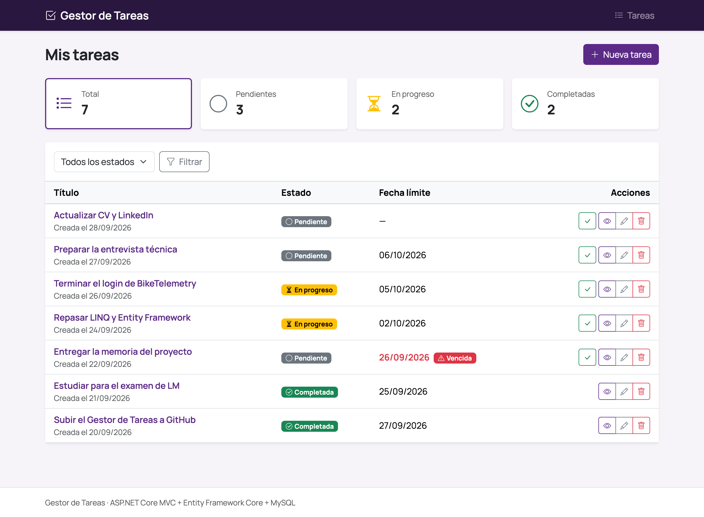
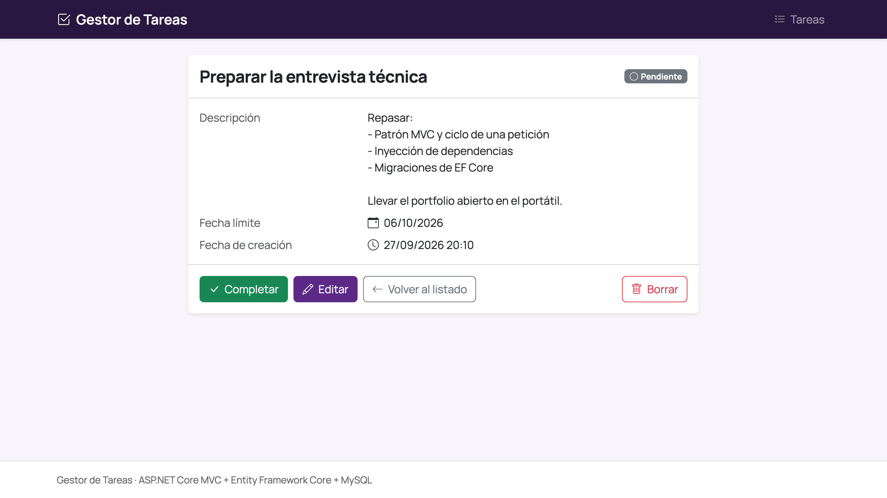
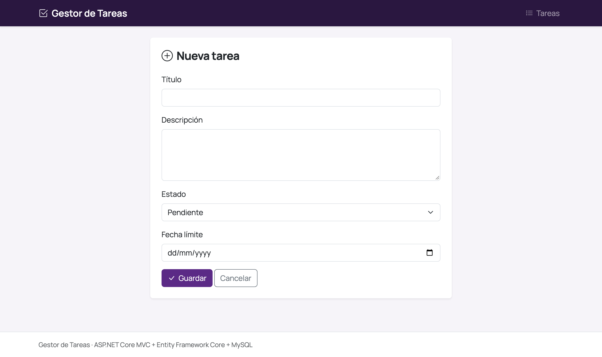
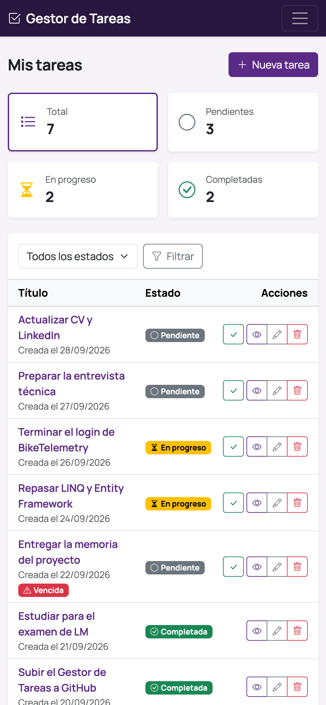

# Gestor de Tareas

Una app web para organizar tareas: crearlas, editarlas, marcarlas como hechas y ver de un vistazo qué tienes pendiente. La he hecho con ASP.NET Core MVC y MySQL mientras estudio 2º de DAW, sobre todo para aprender bien cómo funciona el backend en .NET.



## Qué se puede hacer

- Crear, ver, editar y borrar tareas (el borrado pide confirmación)
- Marcar una tarea como completada con un solo clic
- Filtrar por estado: pendiente, en progreso o completada
- Ver un resumen con cuántas tareas hay de cada tipo
- Las tareas cuya fecha límite ya ha pasado salen marcadas como vencidas
- Se ve bien también en el móvil

| Detalle de una tarea | Nueva tarea |
|---|---|
|  |  |



## Con qué está hecho

- **C# y ASP.NET Core MVC** (.NET 10)
- **Entity Framework Core** para trabajar con la base de datos, con Pomelo como proveedor de MySQL
- **MySQL / MariaDB** (en local uso la de XAMPP)
- **Razor + Bootstrap 5** para las vistas, sin JavaScript propio

## Lo que más he aprendido haciéndolo

La parte visual es sencilla a propósito. Donde he puesto el foco es en el backend:

- **MVC de verdad.** El controlador (`TareasController`) recibe la petición, habla con la base de datos y decide qué vista devolver. Las vistas solo pintan.
- **Base de datos con Code First.** No he creado ninguna tabla a mano. La tabla sale de la clase `Tarea` y de sus atributos (`[Required]`, `[StringLength]`...) mediante migraciones de EF Core, así que la estructura de la base de datos también está en el repositorio.
- **Consultas con LINQ.** El filtro por estado se va construyendo y solo se ejecuta al final, y el resumen de arriba sale de una única consulta con `GroupBy` en lugar de hacer una por estado.
- **La lógica en el modelo.** Saber si una tarea está vencida es una propiedad de la propia clase `Tarea`, no algo calculado en la vista.
- **Algo de seguridad básica.** Los formularios llevan token antifalsificación, solo se aceptan los campos que toca (para que no se pueda colar, por ejemplo, la fecha de creación) y nada que modifique datos se hace por GET.
- **La contraseña de la base de datos no está en el repo.** Va en un `appsettings.Development.json` que está en el `.gitignore`.

## Cómo arrancarlo en local

Necesitas el [SDK de .NET 10](https://dotnet.microsoft.com/download) y un MySQL o MariaDB. Yo uso XAMPP con phpMyAdmin.

**1. Clona el repo**

```bash
git clone https://github.com/<tu-usuario>/gestor-tareas.git
cd gestor-tareas
```

**2. Crea la base de datos**

En phpMyAdmin, crea una base de datos vacía llamada `gestor_tareas` con cotejamiento `utf8mb4_general_ci`.

**3. Pon tu conexión**

Crea un archivo `appsettings.Development.json` en la raíz del proyecto con tus datos. En XAMPP, `root` viene sin contraseña:

```json
{
  "ConnectionStrings": {
    "DefaultConnection": "Server=localhost;Port=3306;Database=gestor_tareas;User=root;Password=;"
  }
}
```

**4. Crea las tablas**

El proyecto usa EF Core 9, porque Pomelo todavía no tiene versión para EF Core 10, así que la herramienta de migraciones tiene que ser la 9:

```bash
dotnet tool install --global dotnet-ef --version 9.0.20
dotnet ef database update
```

**5. Arráncalo**

```bash
dotnet run
```

Y abre la dirección que aparece en la consola (por defecto `http://localhost:5286`).

## Cosas que me gustaría añadir

- Usuarios con login, para que cada uno vea solo sus tareas
- Un calendario donde ver las tareas según su fecha límite
- Tests unitarios con xUnit
- Paginación en el listado
- Publicarla online

## Autor

**Mario Cerdá**, estudiante de DAW
[LinkedIn](https://linkedin.com) · cerbano.m@gmail.com
